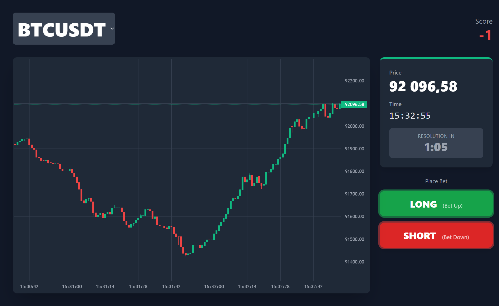

# Up or Down Game

A simple betting game where users can bet on whether the price of a cryptocurrency will go up or down in the next minute.

## UI



## Running the application

### Run the latest published images on a Linux amd64 or arm64 host machine

1.  Generate an `.env` file: `./generate_env.sh`
2.  Copy `docker-compose.prod.yml` and `.env` to the host
3.  Go to the host and run the following command to pull and run the containers:
    ```bash
    sudo docker compose -f docker-compose.prod.yml up -d
    ```

### Run from sources locally

1.  Clone the repository: `git clone git@github.com:bitlank/upordown.git && cd upordown`
2.  Generate an `.env` file: `./generate_env.sh`
3.  Run the following command to build and run the containers:
    ```bash
    sudo docker compose -f docker-compose.local.yml up -d
    ```

## Accessing the game

Open your browser and navigate to `http://<your-server-ip>`. The game is accessible on the standard port 80.

### Backing up the DB

```bash
. .env && sudo docker exec -i upordown-db-1 mariadb-dump upordown --password=$DB_ROOT_PASSWORD > upordown_$(date +%Y-%m-%d).sql
```

### Restoring the DB

```bash
. .env && sudo docker exec -i upordown-db-1 mariadb --password=$DB_ROOT_PASSWORD upordown < upordown_XXXX-XX-XX.sql
```
